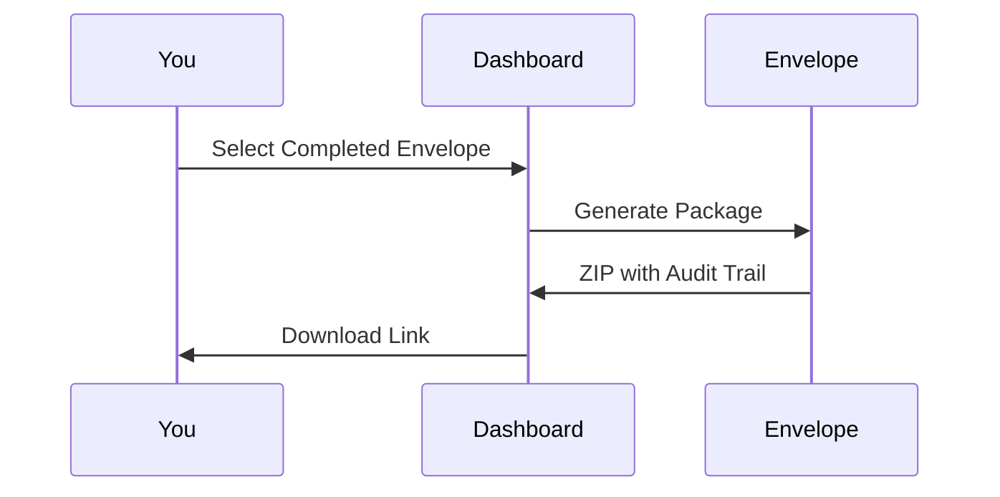

## Overview

Undersigned.co provides essential tools for streamlining e-signature workflows. You can set up signer roles, define routing sequences, create reusable templates, and track document progress with audit-ready completion packages. These features reduce manual effort and ensure compliance.

<Columns cols={3}>
  <Card title="Roles & Routing" icon="users" href="#roles-routing">
    Assign roles and control signing order for efficient workflows.
  </Card>
  <Card title="Templates" icon="file-text" href="#templates">
    Build and reuse templates to launch envelopes quickly.
  </Card>
  <Card title="Progress Tracking" icon="activity" href="#tracking">
    Monitor status and access full completion packages.
  </Card>
</Columns>

## Setting Up Roles, Routing, and Signing Order

Define who signs what and in which sequence to keep workflows moving. Roles include signers, reviewers, or approvers. Routing can be sequential (one at a time) or parallel (multiple simultaneous).

<Callout kind="tip">
  Use sequential routing for legal documents requiring step-by-step approval.
</Callout>

<Steps>
  <Step title="Upload Document" icon="upload">
    Select your PDF or DOCX file from the dashboard.
  </Step>
  <Step title="Assign Roles" icon="user-plus">
    Click "Add Recipient" and select role: `Signer`, `Reviewer`, or `Approver`. Enter email addresses.
  </Step>
  <Step title="Set Signing Order" icon="arrows-up-down">
    Drag recipients to reorder or toggle parallel routing.
  </Step>
  <Step title="Send Envelope" icon="send">
    Review settings and click "Send".
  </Step>
</Steps>

<Tabs>
  <Tab title="Sequential" icon="list">
    Recipients sign one after another.
  </Tab>
  <Tab title="Parallel" icon="git-branch">
    Multiple recipients access simultaneously.
  </Tab>
</Tabs>

## Using Templates for Repeatable Workflows

Templates save time on recurring documents like NDAs or contracts. You prepare fields once and reuse them.

<Steps>
  <Step title="Create Template" icon="file-plus">
    From the Templates tab, upload a base document and place signature fields.
  </Step>
  <Step title="Configure Fields" icon="edit-3">
    Drag-and-drop fields like `Signature`, `Date`, or `Initials`. Assign to specific roles.
  </Step>
  <Step title="Save and Share" icon="save">
    Name your template and generate a public link for intake.
  </Step>
  <Step title="Launch New Envelope" icon="play">
    Select template, fill recipient details, and send.
  </Step>
</Steps>

<CodeGroup tabs="API,CLI">
  ```javascript
  // API: Create envelope from template
  const response = await fetch('https://api.example.com/v1/envelopes', {
    method: 'POST',
    headers: { 'Authorization': 'Bearer YOUR_API_KEY' },
    body: JSON.stringify({
      templateId: 'tmpl_123abc',
      recipients: [{ email: 'signer@example.com', role: 'signer' }]
    })
  });
  ```
  ```bash
  # CLI: Launch from template
  undersigned envelopes:create --template tmpl_123abc \
    --recipient signer@example.com
  ```
</CodeGroup>

## Tracking Progress and Accessing Completion Packages

View real-time status from the dashboard. Every action logs timestamps for audit trails.

<Expandable title="Dashboard Views" default-open="true">
  Track envelopes by status: `Sent`, `In Progress`, `Completed`, `Voided`.

  | Status     | Description                          | Action                  |
  |------------|--------------------------------------|-------------------------|
  | Sent       | Envelope dispatched to recipients    | Resend reminders        |
  | In Progress| Signers viewing or signing           | View signer progress    |
  | Completed  | All signatures collected             | Download package        |
  | Voided     | Cancelled before completion          | Archive or delete       |
</Expandable>

<Callout kind="success">
  Completion packages include signed documents, audit logs, and certificates.
</Callout>

To download:



## Next Steps

<Columns cols={2}>
  <Card title="API Integration" icon="code" href="/authentication">
    Connect via API for automation.
  </Card>
  <Card title="Advanced Branding" icon="palette" href="/configuration">
    Customize sender experience.
  </Card>
</Columns>