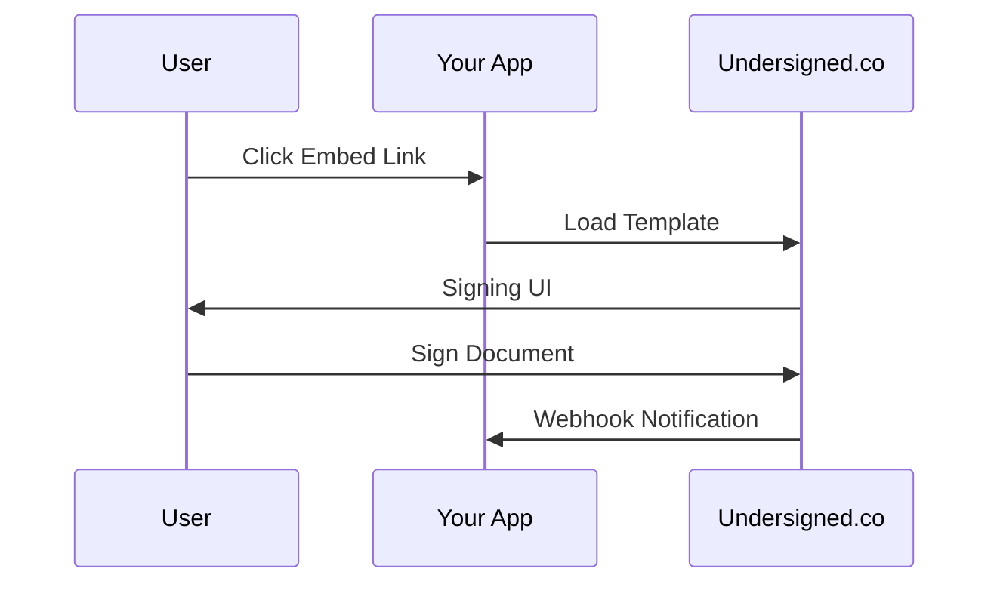

## Overview

Undersigned.co provides flexible integrations to automate your e-signature workflows. Set up webhooks for real-time event notifications, connect with CRM systems like Salesforce, or embed public template links in your apps. These tools help you streamline document routing, track completions, and trigger actions without manual intervention.

<Callout kind="tip">
Enable integrations from your dashboard under Settings > Integrations. Generate API keys there for secure connections.
</Callout>

<Columns cols={3}>
  <Card title="Webhooks" icon="zap" href="#webhooks">
    Receive instant notifications for events like document signed or completed.
  </Card>
  <Card title="CRM Sync" icon="users" href="#crm">
    Push signature data to Salesforce or other CRMs automatically.
  </Card>
  <Card title="Embed Links" icon="link" href="#embeds">
    Add signing directly to your website or app.
  </Card>
</Columns>

## Setting Up Webhooks

Webhooks notify your server of key events such as `document.signed`, `envelope.completed`, or `signer.declined`. You create webhooks via the API or dashboard.

### Create a Webhook

Follow these steps to set up a webhook endpoint.

<Steps>
  <Step title="Prepare Endpoint" icon="server">
    Create a public HTTPS endpoint on your server to receive POST requests from `https://api.example.com`.
  </Step>
  <Step title="Register Webhook" icon="plus">
    Use the API to register your endpoint with Undersigned.co.
  </Step>
  <Step title="Verify Payload" icon="check-circle">
    Handle incoming payloads and respond with HTTP 200.
  </Step>
</Steps>

<Request tabs="cURL,JavaScript">
```bash
curl -X POST https://api.example.com/v1/webhooks \
  -H "Authorization: Bearer YOUR_API_KEY" \
  -H "Content-Type: application/json" \
  -d '{
    "url": "https://your-webhook-url.com/webhook",
    "events": ["document.signed", "envelope.completed"]
  }'
```
````javascript
const response = await fetch('https://api.example.com/v1/webhooks', {
  method: 'POST',
  headers: {
    'Authorization': 'Bearer YOUR_API_KEY',
    'Content-Type': 'application/json'
  },
  body: JSON.stringify({
    url: 'https://your-webhook-url.com/webhook',
    events: ['document.signed', 'envelope.completed']
  })
});
````
</Request>

### Handle Webhook Payloads

Verify the signature using the `X-Webhook-Signature` header. Here's how to process payloads in different languages.

<CodeGroup tabs="JavaScript,Python">
````javascript
app.post('/webhook', (req, res) => {
  const signature = req.headers['x-webhook-signature'];
  const payload = req.body;
  
  // Verify HMAC SHA256 signature with your webhook secret
  if (verifySignature(payload, signature, WEBHOOK_SECRET)) {
    if (payload.event === 'document.signed') {
      console.log(`Document ${payload.data.id} signed by ${payload.data.signer.email}`);
    }
    res.status(200).send('OK');
  } else {
    res.status(401).send('Invalid signature');
  }
});
````
````python
from flask import Flask, request
import hmac
import hashlib

app = Flask(__name__)

@app.route('/webhook', methods=['POST'])
def webhook():
    signature = request.headers.get('X-Webhook-Signature')
    payload = request.get_json()
    
    expected = hmac.new(
        WEBHOOK_SECRET.encode(),
        request.data,
        hashlib.sha256
    ).hexdigest()
    
    if hmac.compare_digest(signature, expected):
        if payload['event'] == 'document.signed':
            print(f"Document {payload['data']['id']} signed")
        return 'OK', 200
    return 'Invalid signature', 401
````
</CodeGroup>

<Response tabs="Success,Error">
```json
{
  "event": "document.signed",
  "data": {
    "id": "doc_123abc",
    "envelope_id": "env_456def",
    "signer": {
      "email": "user@example.com"
    }
  }
}
```
```json
{
  "error": "Invalid signature",
  "code": "webhook_auth_failed"
}
```
</Response>

## CRM Integrations

Connect Undersigned.co to Salesforce for automatic data sync on envelope completion.

<Tabs>
  <Tab title="Native API" icon="plug">
    Use the Salesforce REST API to create records from webhook payloads.
    
    <ParamField path="envelope_id" param-type="string" required="true">
      Matches the Salesforce Opportunity ID.
    </ParamField>
    
    <ParamField body="status" param-type="string">
      Set to `completed` on final signature.
    </ParamField>
  </Tab>
  <Tab title="Zapier" icon="zap">
    Build no-code workflows in Zapier.
    
    1. Trigger: New Webhook from Undersigned.co
    2. Action: Update Salesforce Opportunity
    
    <Callout kind="info">
    Find Undersigned.co in Zapier's webhook triggers.
    </Callout>
  </Tab>
</Tabs>

## Embedding Public Templates

Share public template links for self-service signing. Embed them in your app using an iframe.

```html
<iframe
  src="https://dashboard.example.com/templates/pub_789ghi/embed"
  width="100%"
  height="800px"
  frameborder="0">
</iframe>
```

Customize the embed with query parameters:

<ParamField query="prefill.email" param-type="string">
  Pre-fill signer email.
</ParamField>

<ParamField query="success_url" param-type="string">
  Redirect after signing.
</ParamField>



<Expandable title="Advanced: Custom CSS Branding" default-open="false">
Inject custom styles via the dashboard to match your brand.
</Expandable>