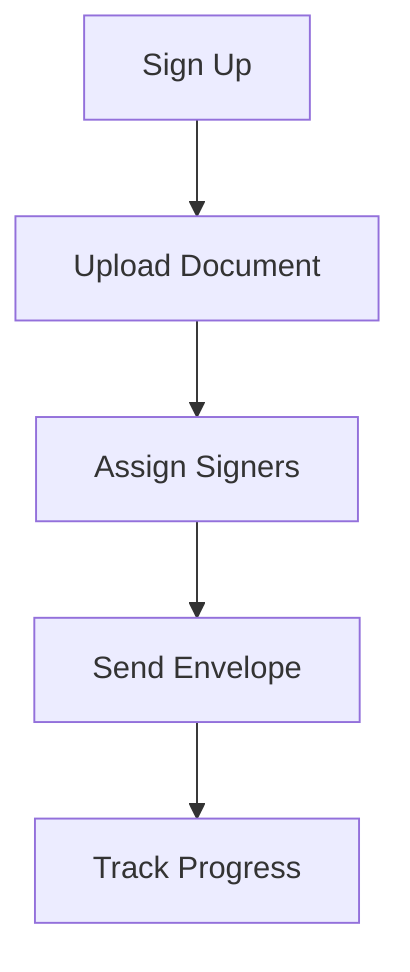

## Prerequisites

<Callout kind="info" title="What you'll need">
- A web browser (Chrome, Firefox, or Safari recommended)
- A PDF or DOC/DOCX file ready for signatures
- Email addresses for your signers
- Access to your email for verification
</Callout>

## Overview

Get up and running with Undersigned.co in under 5 minutes. You'll create an account, upload a document, assign signers, and send your first envelope for e-signatures.

## Step 1: Create and Verify Your Account

<Steps>
  <Step title="Visit the signup page" icon="user-plus">
    Go to [https://undersigned.co/login](https://undersigned.co/login) and click "Create Your Account".
  </Step>

  <Step title="Enter your details" icon="edit-3">
    Provide your email, name, and password. Agree to the terms and click "Sign Up".
  </Step>

  <Step title="Verify your email" icon="mail">
    Check your inbox for a verification email from Undersigned.co. Click the link to activate your account.

    <Callout kind="tip">
      Didn't receive the email? Check your spam folder or click "Resend Verification" on the login page.
    </Callout>
  </Step>

  <Step title="Log in to dashboard" icon="log-in">
    Return to the login page and sign in. You'll land on your dashboard at [https://dashboard.undersigned.co](https://dashboard.undersigned.co).
  </Step>
</Steps>

## Step 2: Upload Your First Document

<Tabs>
  <Tab title="PDF" icon="file-text">
    <Steps>
      <Step title="Click New Envelope" icon="plus">
        From the dashboard, click the "New Envelope" button.
      </Step>
      <Step title="Upload PDF" icon="upload">
        Drag and drop your PDF file or click "Upload Document". Select your file (up to 50MB).
      </Step>
    </Steps>
  </Tab>

  <Tab title="DOC/DOCX" icon="file">
    <Steps>
      <Step title="Click New Envelope" icon="plus">
        From the dashboard, click the "New Envelope" button.
      </Step>
      <Step title="Upload Word Doc" icon="upload">
        Drag and drop your DOC or DOCX file. Undersigned.co converts it to PDF automatically for signing.
      </Step>
    </Steps>
  </Tab>
</Tabs>

## Step 3: Assign Signers and Send the Envelope

<Steps>
  <Step title="Add signers" icon="users">
    Enter the email addresses of your signers. Assign roles like "Signer" or "Reviewer". Set signing order if needed.
  </Step>

  <Step title="Place signature fields" icon="edit-3">
    Drag signature, date, and text fields onto the document. Assign fields to specific signers by selecting them from the recipient list.
  </Step>

  <Step title="Review and send" icon="send">
    Preview the envelope, add a subject and message, then click "Send Envelope". Signers receive an email link instantly.
  </Step>
</Steps>

<Expandable title="Pro Tip: Customize Your Branding" default-open="false">
Enable branding in your account settings to add your logo and colors to signer emails and documents. Go to Dashboard > Settings > Branding.
</Expandable>

## Next Steps

<Columns cols={3}>
  <Card title="Track Signatures" icon="eye" href="/track-envelopes">
    Monitor progress and send reminders from your dashboard.
  </Card>

  <Card title="Create Templates" icon="save" href="/templates">
    Reuse workflows for common documents.
  </Card>

  <Card title="Integrations" icon="plug" href="/integrations">
    Connect with your favorite tools.
  </Card>
</Columns>

<Callout kind="success" title="Congratulations!">
You've sent your first envelope. Check your dashboard for real-time updates as signers complete their actions.
</Callout>